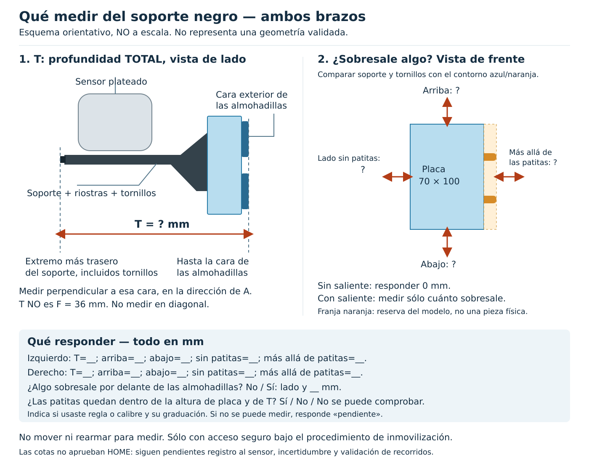

# Cierre práctico de envolvente del soporte — 07-09-2026

## Actualización: dato recibido

Operador: **«T=130, no sobresale nada fuera de los otros márgenes»**.
Se registra T=130 mm y contención nominal; ya no se solicita repetir estos
datos. Aplicación L/R por igualdad anteriormente declarada, no como dos
levantamientos independientes. Instrumento e incertidumbre no comunicados.

Resultado calculado: `u=[−35,+47], v=[−55,+45], profundidad=[−35,+95]` mm,
caja nominal **82×100×130 mm**. No recortar a cero el extremo trasero negativo.
Artefactos nuevos, sin sobrescribir los parciales históricos:
`/home/lacuna/proyectos/Robots/Humanoide-vla-evidence/20260907_clamp_nominal_T130/`.
Ocho tests pasan. Pendientes: incertidumbre, registro geométrico y validación
de recorridos/arranque; permanece sin autorización física.

## Ficha utilizada (histórico de la solicitud, contestada arriba)

Estado: PENDIENTE de comprobaciones físicas; no es un permiso de movimiento.

Figura vectorial propia, no a escala, revisada visualmente. Su forma de soporte
es esquemática, no una reconstrucción de la pieza real; los extremos a medir son
los de la pieza instalada. [Original SVG](assets/2026-09-07_medicion_soporte_T.svg).

No hace falta CAD del fabricante ni repetir A–F. El dibujo existente representa
la placa, no todo el conjunto. No medir con acceso inseguro ni mover/rearmar
el robot para conseguir una cota. Si no hay acceso seguro bajo el procedimiento
de inmovilización aplicable, dejar el dato pendiente. No desmontar el sensor.

## Una nueva profundidad, usando la cara de almohadillas

**T = distancia perpendicular desde la cara exterior de las almohadillas
hasta el punto más trasero del soporte negro, incluyendo riostras y cabezas
de tornillos.** Medir paralelamente a A, no siguiendo una diagonal o una chapa.
No incluir el brazo ni la carcasa del sensor como si fueran soporte negro.

Esto evita volver a localizar el eje: con A=95 mm ya comunicado, el extremo
trasero descriptivo es `95 − T` mm. Puede ser negativo: no recortarlo a cero.
F=36 mm sigue siendo placa+almohadillas, no sustituye T. Registrar resolución
del instrumento y dificultad de lectura; no inventar una incertidumbre nula.

## Comprobaciones de contención, no más fotografías genéricas

Visto perpendicularmente a la cara de almohadillas, comprobar si todo el soporte
negro y su tornillería quedan dentro de la proyección de placa y reserva de patitas:

| Dirección | Referencia existente | Si sobresale |
|---|---|---|
| Superior | Borde superior de la placa, +45 mm del plano de unión | Medir cuánto más allá del borde |
| Inferior | Borde inferior de la placa, −55 mm del plano de unión | Medir cuánto más allá del borde |
| Lado sin patitas | Borde de placa, −35 mm del centro lateral | Medir cuánto más allá del borde |
| Lado de patitas | Extremo de patitas, +47 mm del centro lateral | Medir cuánto más allá de las patitas |

Además, comprobar que ningún tornillo/patita sobresale hacia delante de la
cara de almohadillas y que las dos patitas no sobrepasan los bordes superior
e inferior ni el extremo trasero medido con T. Si algo sobresale, indicar
dirección y distancia; no confirmar contención por semejanza de las piezas.
Aplicar a ambos montajes. Igualdad declarada de abrazaderas no prueba la
posición ni los salientes efectivos de toda su tornillería instalada.

Si se confirma toda esa contención, el **candidato nominal**, aún sin margen,
sería `u=[−35,+47], v=[−55,+45], profundidad=[95−T,95]` mm. Si hay salientes,
ampliar la cara correspondiente. Es una caja envolvente, no hace falta modelar
cada ventana o tornillo por separado. No usar este candidato antes de obtener
las comprobaciones; no se ha escrito en el contrato de montaje.

## Qué cierra y qué no

Estos datos permiten cerrar una envolvente nominal propia del útil. No
identifican por sí solos su transformación al frame del sensor, incertidumbre,
flexión, trayectoria interpolada, distancia de parada ni protección del HOME
de arranque. No constituyen una aprobación para liberar el E-stop.

Resultado disponible: modelo parcial y proyecciones en
`/home/lacuna/proyectos/Robots/Humanoide-vla-evidence/20260907_clamp_simplified_model/`.
