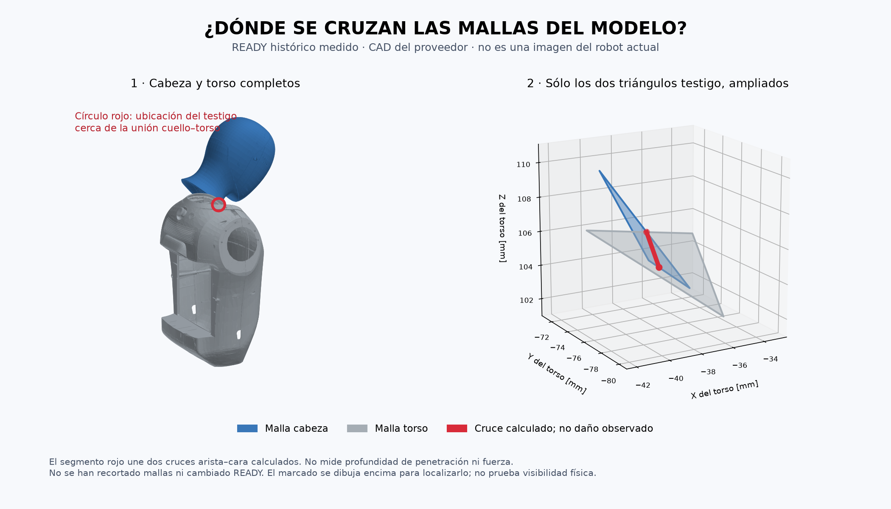

# Auditoría offline de referencias cabeza–torso — 08-09-2026

## Resultado

VERIFICADO en los archivos locales: no se encontró una discrepancia de copia,
escala visual/colisión ni cálculo FK en el par examinado que explique por sí
sola la intersección. No se modifican mallas, ejes, READY ni exclusiones.
Esto NO demuestra que el CAD represente fielmente las superficies físicas.
La premisa del operador de READY real sin contacto permanece separada.

`scripts/audit_neck_model_reference.py` comprueba:

1. URDF utilizado idéntico byte a byte al miembro original del ZIP vendor.
2. Cabeza y torso tienen una malla visual y una de colisión idénticas por link,
   origen cero y escala implícita 1. Tamaños locales cabeza
   209,873×323,979×162,003 mm y torso 277,504×338,875×504,335 mm.
   Son dimensiones del STL, no cotas físicas verificadas.
3. Cadena exacta torso→base de cabeza→yaw→pitch, verificando nombres, padres,
   hijos, orígenes, ejes y tipos antes de usar una fórmula independiente.
   Traslación relativa (0,0,0,16046) m y rotación Rz(yaw) Rx(1,5708) Rz(pitch).
4. FK genérica y fórmula independiente difieren como máximo 1,67e−16 en
   elementos matriciales. Las transformaciones upstream se cancelan al medir
   en coordenadas de torso; poner elevador/cintura a cero no explica este par.
5. Distancia de superficies con BVH y confirmación independiente de cruces
   arista–cara. Se usa yaw;pitch histórico, no un orden alternativo arbitrario.

| Caso | Distancia mínima de superficies modeladas | Cruces independientes del par testigo |
|---|---:|---:|
| Cero sintético | 0,199710 mm | 0 |
| READY nominal (yaw 0, pitch −0,65) | 0 mm | 2 |
| READY medido histórico | 0 mm | 2 |

El histórico procede de `20260904T130344_E6.1C-READY/whole-joint-state-after.json`,
con yaw +0,000191748 y pitch −0,651078971 rad. No es estado actual.
Los triángulos testigo en READY son cabeza 56354 y torso 46391 (base cero).
En el caso medido, los cruces en el frame del torso son aproximadamente
(−37,651; −75,612; 104,400) y (−37,351; −73,665; 105,932) mm.
Se localizan cerca del extremo superior z del STL torso (108,989 mm).
No son medidas de penetración, deformación, fuerza ni coordenadas de un punto
identificado físicamente. La distancia positiva de superficies en cero tampoco
descarta por sí sola contención de sólidos ni valida el resto del robot.

## Evidencia y reproducción

### Ilustración del testigo



`scripts/render_neck_model_witness.py` genera esta vista determinista desde
el informe v2 y las mallas originales. Verifica hashes URDF/ZIP y correspondencia
de los triángulos antes de renderizar. Izquierda: mallas completas cabeza/torso;
derecha: únicamente los dos triángulos testigo ampliados. El círculo se superpone
para localizar el punto aunque quede oculto desde ese ángulo: no prueba acceso
visual físico. Segmento rojo no es profundidad de penetración. Imagen inspeccionada
visualmente; `assets/2026-09-08-cuello/manifest.json` conserva procedencia y hashes.
No se ha identificado todavía una referencia equivalente en una foto real.
No mover ni inclinar la cabeza para reproducir la ilustración.

Render con matplotlib en entorno temporal aislado
`/tmp/cruzr-neck-render-nVBU1W`, sin modificar Python del sistema ni servicios.

Resultados externos en `Humanoide-vla-evidence/20260908_neck_model_reference_v2.json`,
con hashes de XML/YAML, URDF, ZIP, snapshot y módulos de cálculo. El primer JSON
sin sufijo v2 conserva los mismos resultados pero no incluía hashes XML/YAML;
se preserva, no se sobrescribe.

```bash
python3 -m unittest discover -s scripts -p 'test_neck_model_reference.py'
python3 scripts/audit_neck_model_reference.py --output /ruta/nueva/resultado.json
```

Tres tests pasan: contraste de cuatro posturas con FK, rechazo de cambio de
origen y rechazo de ángulos no finitos. La salida exige ruta inexistente.
Prueban cálculo/validación de entrada, no aptitud de movimiento.

## Pendientes y criterio de continuación

INFERENCIA bajo la premisa del operador: hay una discrepancia entre el modelo
y la unión física, pero no está localizada su causa (superficie simplificada,
pieza/modelo distinto, referencia o deformabilidad no representada, entre otras).
No se puede escoger una explicación ni compensación sólo para obtener separación.
No se ha auditado en esta entrega toda la geometría de hombros/codos/muñecas.

El próximo contraste útil sería vincular el área testigo del cuello con la
superficie real mediante una referencia física identificable; todavía no se
solicita una foto ni maniobra porque esa referencia no se ha ilustrado.
El montaje de abrazaderas, escena y ejecución/parada siguen pendientes aparte.
HOME→READY→HOME no queda aprobado. Cero conexiones al robot, movimientos,
servicios, cambios de protecciones o despliegues. No hay monitor activo.
