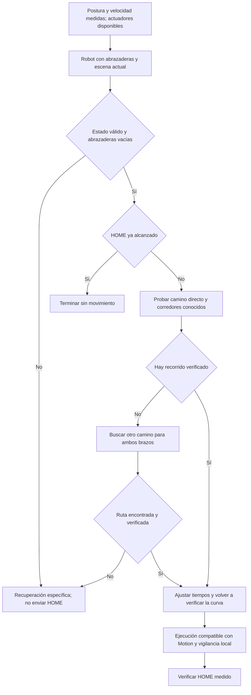

# Retorno a HOME desde posturas generales con abrazaderas

**Actualización 2026-09-11:** añadido certificado de progreso independiente por
eje y captura/análisis pasivos; 90 pruebas offline pasan. La lectura bajo paro
confirmó ambos paros y no recibió actuadores. Modelo aún con 54 conflictos por
referencia; ejecución, parada y HOME interno general pendientes.
[Resultado, receta y situación del arranque](CRUZR_HOME_CAPTURA_Y_PROGRESO_INDEPENDIENTE.md).

**2026-09-10, Europe/Madrid — planificador general y revisión de Motion probados
offline; integración física pendiente.** Las tareas operativas PICO/HOME de 20 s
permanecen intactas. La ampliación más reciente realizó consultas y copias de
lectura al robot, sin movimientos ni escrituras remotas. El estudio inicial de
4.000 posturas que se conserva más abajo precede a estas implementaciones.

**Última ampliación:** se recuperaron siete mallas sin recortar superficies;
quedan once envolventes y 54 conflictos identificados: 30 invariantes con
base/ruedas fijas y 24 de pares móviles. Se construyó una vista 3D comparativa.
La rutina numérica de Motion es cúbica y se contrastó mediante emulación en
1.312 casos; aún no se valida ejecución/seguimiento/parada. Ya hay conversión
explícita de marcos CAD/herramienta nativa y auditoría de límites de configuración.
[Resultados y punto de reanudación](CRUZR_HOME_GEOMETRIA_Y_MOTION.md).
37 pruebas del paquete pasan; `--timing-law cubic-rest` sigue siendo offline.
La última consulta de actuadores no recibió muestras y después falló SSH por
tiempo de conexión. No se liberó ni rearmó el paro.

## Implementación inicial, conservada como historial

Disponible [`cruzr_plan_home.py`](../../scripts/teleoperation/cruzr_plan_home.py):
entrada20D/escena archivadas, robot completo, caminos directos y por corredores,
RRT-Connect, subdivisión con cotas de separación continua, eliminación de desvíos
comprobados y tiempos quintic con un reloj común. Conserva brazos asimétricos.
28 pruebas funcionales pasan, incluidas búsqueda alrededor de un obstáculo,
obstáculos delgados entre estados libres y contención de sólidos sin cruce de
superficies. [Uso, instalación sólo PC y formatos](../../scripts/teleoperation/general_home/README.md).

El nuevo auditor comprueba982pares internos de45geometrías; omite ocho pares
internos de conjuntos unidos rígidamente, conservando sus piezas contra el resto.
Completa provisionalmente tres enlaces con visual y encierra18mallas abiertas
en sólidos convexos/cajas completas. El modelo suministrado rechaza54pares en
HOME y cada PICO sintético por solapamiento o separación≤2mm. No son54contactos
reales. Una sonda adicional de superficies FCL, sin envolventes ni garantía de
volumen, encontró12pares intersectados enPICO; incluye articulaciones del cuerpo,
hombros, codos y muñecas. No basta sustituir OBB por triángulos para resolverlo.

**No hay todavía retorno general ejecutable:** el plan de ejemplo en este CAD
se rechaza desde su entrada. No se exporta XML, no hay `--run` y ningún informe
otorga aprobación física. Hay que resolver el modelo derivado/montaje y el
contrato de Motion, estabilidad/dinámica/parada y HOME interno. El ajuste temporal
usa caps de diseño, no límites certificados ni velocidad ligada a frenado medido.
La nueva búsqueda abarca20ejes; la preferencia de búsqueda con cuerpo fijo del
diseño siguiente todavía no es una fase separada de RRT.

PC: nuevo `.venv/general-home` con dependencias fijadas; sin alterar el Python
del sistema. Evidencia/hashes/backup previo:
`../Humanoide-vla-evidence/20260910T134348Z_GENERAL-HOME-IMPLEMENTATION/`.
Reversión y receta reproducible en ANL-01 del registro de adaptaciones.

## Decisión

El retorno debe calcularse desde la postura medida, con colisiones del robot
completo y de la escena, y elegir el recorrido que necesite menos movimiento.
Abrir, bajar y cerrar sirve como candidato para algunas posturas; no es una
regla universal. Codos, muñecas y cada brazo deben poder seguir caminos distintos.

El alcance alcanzable es: **encontrar y verificar un camino a HOME desde una
postura válida que tenga salida, o explicar por qué no existe un camino
demostrado y conservar la parada**. No existe un movimiento automático válido
desde literalmente cualquier situación: contacto, carga sujeta, encajamiento,
fallo de actuadores o falta de espacio requieren su recuperación específica.
No se confunde un tiempo de búsqueda agotado con demostrar que no existe ruta.

## Qué añade esta revisión 3D

El paquete tiene 48 enlaces: 42 con geometría de colisión. Otros tres tienen
malla visual pero no de colisión: `head_yaw_link`, `L_shoulder_pitch_link` y
`R_shoulder_pitch_link`. Se usaron sus envolventes visuales como cobertura
provisional **sólo para este estudio**. Los otros tres enlaces sin geometría
son referencias intermedias (`head_base_link`, `L/R_arm_base_link`). Hay que
confirmar que sus piezas físicas quedan representadas por los enlaces vecinos.

Así se obtienen 45 enlaces con volumen y 990 pares posibles antes de agrupar
piezas rígidas y descartar pares distantes. El estudio de este turno comprobó
87 pares abrazadera–robot/abrazadera–abrazadera, incluidos los seis pares locales
ya registrados. No comprobó los 990: **los análisis anteriores de abrazaderas
no son una validación de todas las autocolisiones**, por ejemplo codo–torso.
Las orientaciones de ruedas pasivas se fijaron a cero para el estudio;
no se conocen aquí sus orientaciones reales.

Las nuevas mallas de abrazadera coinciden con las capturadas del robot. Se
conservan los 2 mm de margen geométrico y el intervalo axial de 0–40 mm del
registro anterior. No se ha declarado resuelta la correspondencia física del
montaje por disponer del CAD. La discrepancia de cabeza de 4,6 mm entre URDF
completo y runtime sigue necesitando reconciliación antes de sustituirlo.

### Dos fallos concretos de una apertura fija

1. **Límites:** el límite inferior de hombro roll en el modelo es −1,885 rad.
   Desde −1,60 rad, la apertura relativa del HOME interno de −0,40 rad produciría
   −2,00 rad: objetivo fuera del límite. Esta es una comprobación matemática;
   no se afirma que esa postura se haya ensayado ni que Motion acepte el objetivo.
2. **Dirección del movimiento:** en brazos doblados/girados, abrir el hombro
   no garantiza alejar la abrazadera de todas las otras piezas. Un ejemplo
   sintético pasó de una separación proyectada abrazadera derecha–torso de
   +20,94 mm a −8,37 mm al abrir. El signo negativo es **solapamiento de
   envolventes**, no una colisión real demostrada entre mallas.

Se generaron 4.000 posturas con cuerpo a cero y perturbaciones independientes de
brazos respecto a PICO, dentro de los límites del modelo. No son una distribución
de uso real ni se demostró que todas sean alcanzables. De ellas, 1.845 tenían
más de 10 mm entre las envolventes de los pares no locales comprobados.
Desde ese subconjunto, la apertura fija excedía límites en 391 casos; en otros
siete, con objetivo dentro de límites, terminaba en solapamiento potencial.
No se deducen probabilidades de accidente de estos recuentos.

### Refinar las uniones sin ocultar colisiones

El URDF establece esta cadena en ambos brazos:

```text
wrist_pitch_link -- articulación wrist_roll --> wrist_roll_link
wrist_roll_link  -- unión fija --> sixforce_link -- unión fija --> hand_link
```

Por tanto, muñeca final, sensor y abrazadera pueden representarse en el nuevo
comprobador como un conjunto rígido conservando **toda** su geometría. El
solapamiento interno de sus piezas de montaje no cambia al mover el brazo.
Esto permite eliminar pruebas internas redundantes de ese conjunto, tras
verificar el montaje, sin recortar la patita ni ignorar el conjunto contra el
cuerpo. `wrist_pitch_link` queda al otro lado de una articulación móvil:
**no corresponde excluir su par completo con la abrazadera por ser vecino**.

Para los pares dudosos, usar distancias entre mallas o piezas convexas cuya
unión contenga el sólido completo. Revisar escala, transformaciones, huecos,
integridad del sólido y margen. Una caja que rellena espacio vacío sirve como
primer filtro; su solapamiento debe pasar a un cálculo más preciso. Tampoco
basta comprobar sólo intersección entre triángulos: considerar contención de
un sólido dentro de otro. No se modificaron exenciones del robot en este turno.

## Diseño propuesto del retorno



1. **Entrada:** veinte articulaciones con nombres/orden comprobados, posición,
   velocidad, edad de muestra, consignas y estado de actuadores. Añadir modo,
   controlador exclusivo, efector/carga y escena con fecha/marco. No completar
   lecturas ausentes con ceros ni transformar una postura en PICO por proximidad.
2. **Escena:** robot completo, suelo, mesa y caja, además de objetos/personas
   detectados o zona preparada. El mapa de navegación 2D no acredita el espacio
   del barrido de brazos ni la altura del tablero. Con caja sujeta, continuar
   una recuperación de depósito/carga; no abrir o mandar HOME vacío.
3. **Candidatos rápidos:** comprobar primero un retorno directo y caminos
   cortos conocidos desde la postura real. Si ya está cerca de HOME y todo el
   barrido es válido, no abrir y bajar por rutina. La orientación de muñeca
   sólo se cambia si mejora un recorrido comprobado, no como paso obligatorio.
4. **Búsqueda general:** planificar ambos brazos como un sistema de 14 ejes;
   un brazo aparentemente quieto sigue siendo obstáculo para el otro. Probar
   cuerpo inmóvil primero; si hace falta mover elevador/cintura, ampliar el
   problema incluyendo sus límites y estabilidad. No ordenar un retroceso fijo
   de chasis como recuperación genérica. Si la mesa impide salir, la retirada
   requiere un plan de base con escena y volumen completos.
5. **Camino continuo:** comprobar cada segmento completo, con la ley temporal
   que ejecutará el controlador. Dos extremos libres no bastan. Usar detección
   continua compatible con esa cinemática o subdivisión con cotas verificadas;
   no fijar un muestreo grueso sólo para conseguir planificación rápida.
6. **Tiempos:** minimizar tiempo sujeto a separación, límites por articulación
   y dinámica; conservar simultaneidad cuando ambos brazos puedan moverse sin
   interferirse. Cerca de obstáculos, ajustar velocidad al espacio de parada.
   Revalidar la curva final después de suavizar o cambiar sus tiempos.
7. **Ejecución:** el adaptador debe demostrar que Motion recibe y reproduce la
   trayectoria comprobada. No asumir que expone `FollowJointTrajectory`, ni que
   copiar puntos a MetaMove reproduce la curva del planificador. Lecturas
   obsoletas, desvío, contacto o pérdida de control exclusivo requieren la
   respuesta de parada definida, sin reintentar HOME automáticamente.

Un planificador con MoveIt 2 puede mantener geometría, estado y restricciones;
su documentación distingue autocolisión y colisión con el entorno. En particular,
el chequeo de autocolisión descrito usa mallas sin padding: hay que incorporar
explícitamente nuestros márgenes al diseño, no asumir que un padding de escena
los cubre. [Planning Scene](https://moveit.picknik.ai/main/doc/examples/planning_scene/planning_scene_tutorial.html).

OMPL permite buscar caminos, pero el verificador de estados y segmentos debe
configurarse expresamente; su núcleo no aporta por sí solo la geometría. La
documentación advierte que un muestreo grueso puede saltarse estados inválidos.
Una búsqueda RRTConnect puede ser una base de implementación a evaluar, no una
garantía de tiempo o de seguridad para este robot.
[Validación en OMPL](https://ompl.kavrakilab.org/stateValidation.html).

## Velocidad y margen de parada

La prioridad es evitar apertura innecesaria y recorridos largos antes de subir
la velocidad. Las alternativas anteriores desde PICO dan aproximadamente
15–19 s de movimiento calculado frente a 20 s; no se promete ese tiempo desde
posturas generales. Una postura cercana a HOME puede necesitar mucho menos;
una postura cruzada puede requerir más recorrido o una maniobra por etapas.

El margen debe distinguir geometría/registro, error de seguimiento, escena y
movimiento durante reacción/parada. Para un par de piezas se requiere que la
distancia calculada exceda la suma de las cotas aplicables. El presupuesto de
2 mm no sustituye una cota de parada ni debe duplicarse sin definir su alcance.

Los 5° por articulación comunicados anteriormente son un escenario conservado,
no una especificación dinámica medida. Las cotas globales por alcance pueden
ser demasiado amplias: refinar por configuración, articulaciones que afectan
al par y conjuntos barridos de error, manteniendo los errores admitidos. Si la
cota sigue sin separar piezas, hay que cambiar camino o dominio de operación.
Reducir velocidad sólo resuelve la parte de error/parada dependiente de ella.

Propuesta para cerrar los datos dinámicos sin otra campaña de fotos: registrar
automáticamente posición ordenada/medida, velocidad y tiempos durante ensayos
supervisados del perfil existente, y caracterizar la respuesta de parada.
Un máximo observado en una prueba no se convierte por sí solo en cota para
todas las posturas/cargas. El PC no debe ser la única capa que vigile o frene;
la respuesta ante desconexión y parada debe residir en el controlador adecuado.

Ruckig permite suavizar con límites de jerk dentro de MoveIt; eso no acredita
los límites del Cruzr ni el seguimiento de Motion. TOTG puede modificar puntos
de paso dentro de una tolerancia, por lo que la trayectoria resultante requiere
comprobarse otra vez. No usar límites dinámicos genéricos para el elevador:
el URDF tiene velocidad/esfuerzo cero en elevador y cintura.
[Parametrización temporal](https://moveit.picknik.ai/main/doc/examples/time_parameterization/time_parameterization_tutorial.html).

## Integración con el HOME del arranque

Hay dos entradas distintas: el script del PC y `cruzr/home` que puede lanzar
Control Center al arrancar/cambiar de modo. Mejorar únicamente el script deja
el segundo camino fuera del planificador. La recuperación general necesita
integrar la misma validación en el camino interno o restringir explícitamente
ese HOME a sus estados de arranque conocidos. No cambiar de modo para obtener
control si ese cambio puede iniciar antes la trayectoria interna.

No se propone sustituir ahora el HOME de arranque por una conexión al PC:
introduciría una dependencia nueva durante el encendido. Es necesario definir
un contrato local en Motion para el plan, su ejecución, rechazo y parada.
Mientras ese contrato no esté implementado y probado, la ruta interna actual
no se presenta como válida desde todas las posturas.

## Trabajo concreto para implementar la propuesta

| Entrega | Comprobación que debe superar |
|---|---|
| Modelo de colisiones derivado, separado del paquete original | Cobertura de todas las piezas, escala/registro, conjunto rígido de muñeca y chequeo de sus partes móviles; casos de falsos positivos y contactos conocidos |
| Planificador de postura medida a HOME | Referencias PICO, brazos abajo, asimetrías, codos doblados, muñecas giradas, proximidad a límites, mesa presente y falta de salida; no copiar posiciones a ciegas |
| Validador de curva y tiempos | Ningún segmento ni suavizado sin comprobar; límites y error/parada especificados; aceptación/rechazo reproducible |
| Adaptador y supervisor Motion | Equivalencia de interpolación, exclusividad, frescura, cancelación/desconexión y arranque interno; pruebas iniciales sin actuadores |
| Ensayos físicos por dominio | Ampliar las posturas y velocidades admitidas con evidencia; mantener recuperaciones de carga/contacto separadas |

La revisión inicial entregó diagnóstico, contraejemplos reproducibles y diseño.
La implementación posterior añade el planificador offline indicado al inicio;
no entrega un ejecutor físico general ni modifica los scripts operativos.

## Evidencia y reproducción de la revisión inicial

Directorio privado externo al repositorio:
`../Humanoide-vla-evidence/20260910T124156Z_GENERAL-HOME-3D-REVIEW/`.
Incluye `review.py`, `review.json`, `verification.json` y respaldo documental
previo. El JSON conserva semilla, dominio muestreado, posturas de cinco ejemplos,
87 pares considerados, limitaciones y SHA256 de URDF/mallas/fuentes.
El programa sólo lee archivos y escribe un informe nuevo; rechaza sobrescribirlo.

Se contrastaron diez estados de los ejemplos, 48 transformaciones por estado,
con la cinemática escalar existente; diferencia máxima cero. El SAT batched y
escalar también coincidieron (diferencia cero en los casos contrastados).
Esto verifica consistencia numérica entre implementaciones, no el robot físico.
Las mallas originales y el código operativo no se modificaron. La reversión
de esta revisión consiste sólo en retirar selectivamente sus documentos y
entradas de registro, preservando cambios posteriores; no necesita rollback
remoto. No se hicieron instalaciones, recargas, movimientos ni commit.
